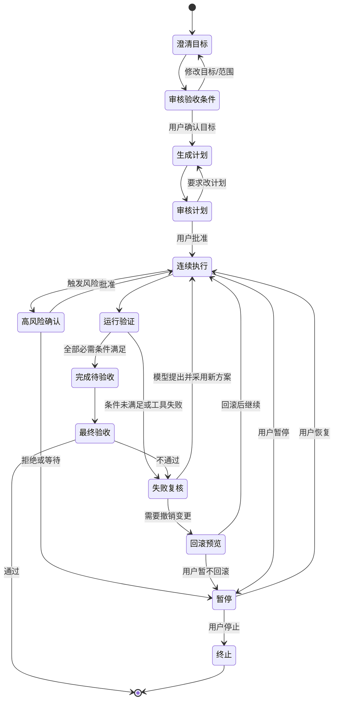

# 自主开发舱设计

## 1. 产品定位

“自主开发舱”是绑定当前项目的长链路开发工作区。用户描述目标，模型负责理解目标、选择领域能力、拆解任务、调用工具和 MCP、修改项目、运行验证并根据结果继续迭代；用户在关键门点审核并最终验收。

它不是一个新的 Agent 执行引擎，而是现有 Harness、ToolSpec、审批、MCP 路由、项目沙箱和变更集能力的统一工作台。模型的自主权属于任务编排层，系统的权限、停止、审计和恢复属于控制层。

## 2. 已确认的产品决策

- 作用域只绑定当前项目，不能跨项目读取、写入或调用项目外资源。
- 允许连续执行，不设置普通工具步数上限；模型可以自行决定调用工具、联网、安装依赖和使用任意已授权 MCP。
- 模型允许联网下载自己需要的工具、依赖和 MCP 组件；下载可自动进行，安装、启用或执行外部代码仍按风险进入审核队列。
- 模型可以修改项目代码、UI、游戏运行状态和 EDA 软件状态。
- 模型先提出执行计划和验收条件，用户可以编辑验收条件后再批准。
- 普通开发任务在计划确认后连续执行；高风险或不可逆操作仍逐项确认。
- 用户可以随时暂停、停止、撤销本轮变更或要求模型重新规划。
- 系统权限、审批规则、项目边界、审计和恢复机制不能由模型自行修改。

## 3. 工作台结构

```text
┌────────────────────────────────────────────────────────────────────┐
│ 项目栏：项目名 · 当前分支/工作区 · 运行状态 · 暂停 · 停止 · 恢复     │
├───────────────┬──────────────────────────────────┬─────────────────┤
│ 目标与验收    │ 实时工作区                       │ 审核队列        │
│               │                                  │                 │
│ 用户目标      │ 当前阶段 / 下一步                 │ 待确认动作      │
│ 模型澄清      │ 时间线与模型思考摘要              │ 计划与验收条件  │
│ 验收条件编辑  │ 工具/MCP 调用                     │ 高风险变更      │
│ 版本历史      │ 文件、EDA、游戏预览               │ 失败恢复方案    │
│               │ 验证结果与失败证据                │ 最终验收        │
├───────────────┴──────────────────────────────────┴─────────────────┤
│ 变更摘要：文件 diff · UI 前后对比 · EDA 网表/规则差异 · 运行截图     │
└────────────────────────────────────────────────────────────────────┘
```

### 3.1 目标与验收区

展示当前用户目标、模型的理解、假设、范围和验收条件。验收条件是结构化条目，而不是一段不可编辑的文本：

```json
{
  "id": "accept-1",
  "statement": "EDA 原理图 ERC 无错误，允许的电源标记例外需逐项说明",
  "method": "run_erc",
  "evidence": ["erc-report.json", "schematic.kicad_sch"],
  "required": true,
  "user_approved": false
}
```

用户可以修改表述、设为必需/可选、指定证据，或要求模型补充验收条件。模型后续每次重规划都必须说明哪些条件已满足、哪些条件仍未满足。

### 3.2 实时工作区

按时间线显示阶段、任务、工具/MCP、结果和验证证据。默认展示人类可读摘要；展开后查看具体工具名、参数摘要、输出摘要、耗时、连接器和审批记录。敏感参数不进入前端事件正文。

工作区应始终提供三个动作：暂停当前波、停止整个工作流、要求模型重新规划。停止是可恢复的中断，终止是进入终态并保留审计记录。

### 3.3 审核队列

审核队列按风险排序，分为：

1. 计划审核：任务 DAG、工具范围、预计副作用和验收条件。
2. 高风险动作：安装依赖、写入项目外部路径、修改连接器、启用 MCP 能力、删除/覆盖大量文件、提交或回滚变更集。
3. 失败恢复：重试、回滚、换工具、改变目标或降低范围。
4. 最终验收：验收条件、证据、变更摘要和遗留风险。

普通文件编辑、读取、测试、联网下载和已授权 MCP 的只读调用可以在计划批准后连续执行；安装、启用或执行外部代码时自动进入队列。

## 4. 状态机



### 4.1 连续执行循环

每一轮执行遵循同一契约：

1. 模型读取当前项目快照、已完成任务、工具能力和验收状态。
2. 模型选择下一批可并行任务，并为每项任务声明目标、依赖、工具/MCP、预期证据和副作用等级。
3. 系统检查项目边界、工具白名单、MCP 能力授权、审批状态和幂等键。
4. 允许的任务连续执行；触发风险门的任务进入审核队列。
5. 系统收集结果和证据，运行领域验证器。
6. 模型根据失败证据继续、重试、替换方案或提出回滚；超过资源/失败策略时暂停并请求用户决定。

普通任务不设工具步数上限，但必须有可解释的停止条件：所有必需验收条件满足、用户停止、系统资源/时间保护触发、或模型明确报告无法继续。

## 5. 权限与审批

### 5.1 权限分层

| 层级 | 示例 | 默认行为 |
|---|---|---|
| L0 只读 | 读文件、检索项目、列出 MCP 工具、查看日志 | 自动执行 |
| L1 可逆修改 | 编辑项目文件、生成构建产物、运行测试 | 计划批准后自动执行 |
| L2 外部或配置副作用 | 安装依赖、写入连接器配置、启用 MCP 能力、启动外部应用 | 进入审核队列 |
| L3 高风险/不可逆 | 项目外写入、删除大量文件、提交/回滚、发布、覆盖 EDA 关键资产 | 逐项确认 |

模型可以申请更高权限，但不能修改 L2/L3 的审批规则，也不能伪造用户批准。`dev_mcp_add`、`dev_mcp_decide`、变更集提交/回滚继续复用现有审批门；工作台只负责把阻断原因和目标呈现给用户。

### 5.2 MCP 使用规则

- 领域词触发后，模型先通过现有发现路由给出候选 MCP 卡片。
- 模型可以联网下载完成任务所需的工具、依赖和 MCP 组件，并记录来源、版本、哈希和下载结果。
- 已连接且能力已批准的 MCP 可直接调用。
- 需要注册或密钥的 MCP 打开注册页/设置页，完成后再回到工作流。
- 新连接器必须经历添加、探活、工具发现、能力审批四步；不能因为进入自主开发舱而跳过这些步骤。
- 写入型 MCP 调用必须声明 `side_effect=true`，默认不跨连接器重试；系统记录幂等状态，执行状态不明时阻断重复写入。

## 6. 预览适配器

统一使用“变更前快照 → 模型提案 → 变更后结果 → 验收证据”的预览协议，不强行把所有领域转成代码 diff。

### 普通代码/UI

- 文件级 diff、语法/类型检查结果、构建结果。
- UI 页面前后截图、交互录制和可访问性检查。
- 批量修改按文件/目录分组，显示影响范围和可回滚变更集。

### EDA

- 原理图前后图像或结构化元件/网络差异。
- 网表差异、封装/规则变化、BOM 差异。
- ERC/DRC 报告、违规项和豁免依据。
- PCB 关键区域高亮，避免只展示文本 diff。

### 游戏/引擎

- 运行画面截图或短录屏、场景树差异、资源依赖变化。
- 输入脚本、运行日志、性能采样和自动化 Playtest 结果。
- 模型可以在预览中连续迭代，但每次迭代都挂接到同一变更集，便于整体回滚。

### MCP/外部工具

- 调用前显示连接器、工具名、参数摘要、权限级别和预期副作用。
- 调用后显示结构化结果、失败原因、重试次数和是否发生不确定执行。

## 7. 失败、暂停和恢复

- 失败先保留现场：checkpoint、项目快照、工具调用账本、事件轨迹和当前验收状态。
- 模型提出最多三个恢复方向：修复后重试、替换工具/MCP、回滚后换方案。用户可编辑或选择。
- 同一工具连续失败、验证结果反复不改善、或执行状态不明时自动暂停，不继续扩大变更范围。
- 回滚前先展示影响文件/资产和预计恢复点；执行回滚仍走现有 `rollback_changeset` 审批门。
- 进程重启后从 checkpoint 恢复；执行状态不明的副作用调用必须阻断，等待人工处理。
- 终止后保留工作流历史和变更集，不删除用户数据。

## 8. 对现有代码的落地映射

### 可直接复用

- `GameWorkflowManager`：状态、checkpoint、SSE、计划/执行审批、执行波和失败重规划。
- `project_id/project_root`：当前项目边界与同项目单工作流互斥。
- `ToolSpec`、沙箱和 `require_approval`：真正的副作用控制面。
- `dev_route_connector`、`dev_list_connector_tools`、`dev_mcp_call`：已授权 MCP 的路由和调用。
- `dev_mcp_add/probe/discover/decide`：MCP 装配与能力审批。
- `dev_changeset`、`rollback_changeset`：跨区域变更集和整体回滚。
- `WorkflowCard.vue`、`WorkflowGateDialog.vue`：现有工作流卡片和人工门，可扩展为自主开发舱。

### 建议新增的边界

1. `agent_runtime/cockpit_policy.py`：风险分级、停止条件、项目外路径判断和审批映射。
2. `agent_runtime/acceptance_contract.py`：验收条件结构、证据绑定、通过/不通过结果。
3. `agent_runtime/preview_adapters/`：code、ui、eda、game、mcp 五类预览适配器。
4. `agent_runtime/recovery.py`：失败方案、回滚预览和恢复决策的持久化模型。
5. `frontend/src/workbench/components/AutonomousCockpit.vue`：工作区壳；现有 WorkflowCard 作为兼容入口。
6. `frontend/src/workbench/components/CockpitApprovalQueue.vue`：把计划、高风险动作、恢复和最终验收统一成队列。

## 9. 分阶段实施

### Phase 1：工作区壳与验收契约

- 新增自主开发舱页面和当前项目绑定。
- 把计划、验收条件、实时事件和最终审核放进一个界面。
- 复用现有工作流 API，不改变现有工具权限。
- 验收：刷新页面、重启后仍能看到同一工作流和验收状态。

当前实现：工作台已增加「自主开发舱」入口，展示当前项目工作流的目标、任务、实时事件与验收条件；新目标交给现有对话工作流启动。计划生成后会提出结构化验收条件，用户可在计划审核窗口修改，批准时记录版本，执行完成后由用户做最终验收。工作流 JSON 持久保存条件与决定；任务计划变化会撤销原验收批准。当前证据展示先复用任务结果，领域预览、统一高风险审核队列和失败后的继续迭代属于后续阶段。

### Phase 2：连续执行与风险队列

- 执行波支持无普通步数上限，但加入停止条件和资源保护。
- 工具/MCP 事件按风险分层，L2/L3 进入审核队列。
- 暂停、恢复、停止和失败复核可在工作区直接操作。
- 验收：普通编辑可连续完成；高风险 MCP 添加和变更集操作必须停在队列。

当前实现：原有 `require_approval` 门禁在阻断时写入项目内 `approval_requests.jsonl`，自主开发舱汇总计划审核、最终验收、项目外文件审批和 L2/L3 门禁请求。队列可以批准安装工具、分区变更、提交和回滚等已有门禁动作；MCP 连接与能力请求只提供跳转到 MCP 设置页的入口，不能在自主开发舱绕过既有用户审批。批准后仍需模型重试原操作，审批目标保持精确绑定。

### Phase 3：领域预览适配器

- 先实现通用预览协议：变更前后值、文件/资源、差异、运行输出、图片、音频、视频、模型、结构化报告和自定义证据都能挂到同一工作流。
- 再按项目实际需要加载领域适配器；EDA 网表/ERC/DRC、游戏场景/试玩只是适配器示例，不能成为核心类型限制。
- 适配器必须声明输入类型、渲染方式、证据和验证结果；未知类型仍保留通用证据卡片，不能静默丢弃。
- 验收：任何领域都能看到变更前后结果与结构化证据，而不只是一段模型文本。

当前实现：新增 `docmind.preview.v1` 通用协议和工作流预览端点。核心可以识别代码、文本、差异、图片、音频、视频、交互式实时画面、模型、结构化数据、二进制和未知证据；工具通过结果里的 `artifacts`、`file_changes` 或 `evidence` 提交内容，工作台按类型渲染，未知类型保留路径和证据。领域适配器通过 `register_preview_adapter(name, handler)` 注册，输入和输出仍遵循同一协议，可以扩展 EDA、游戏、CAD、数据分析或其他领域而不修改执行引擎。`interactive` 产物会在自主开发舱中以 iframe 形式显示可操作画面，适合 Godot Web、浏览器应用、仿真器或本地预览服务；模型后续修改项目后可以刷新同一画面。预览包同时提供文件变更的新增/修改/删除统计、前后行数和差异摘要；工作台访问项目文件时经过 `/api/agent/workflow/{id}/preview/artifact/{artifact_id}`，只允许当前工作流项目根目录下、且已登记在预览包中的资源。

### Phase 4：恢复与审计强化

- 完善不确定副作用、回滚预览、幂等键和审计导出。
- 加入工作流评估：验收通过率、重规划次数、失败恢复率和用户否决率。
- 验收：故障注入后不会重复写入，能从 checkpoint 恢复并给出可操作的下一步。

## 10. 首版验收标准

- 用户能用一句自然语言创建当前项目的自主开发任务。
- 模型能提出可编辑的验收条件和任务计划。
- 用户批准计划后，普通任务可以连续调用工具/MCP并修改项目。
- 新 MCP、密钥、安装依赖、项目外路径、删除/覆盖和提交/回滚动作会明确停在审核队列。
- 用户能实时暂停、停止、恢复，并看到每次工具调用和验证证据。
- 失败后模型必须给出失败证据和恢复方案，不能静默无限重试。
- 代码、EDA、游戏三类变更都能看到对应预览和最终验收结果。
- 进程重启后可从 checkpoint 恢复；变更集可以整体回滚。

## 11. 尚需实现时确认的两个产品选择

### 默认审核粒度

建议默认采用“计划一次确认 + 高风险逐项确认”。如果用户选择“全自动”，也只放宽 L1；L2/L3 仍由系统强制停住。

### 预览主视图

当前首版视觉：顶部是目标输入和工作流状态；主体三栏分别展示“目标与验收”“执行现场与通用预览”“审核队列与历史”。预览卡按产物类型自动显示媒体、前后内容、变更统计和证据；交互式画面支持拖拽调整大小、框选问题区域和悬浮反馈，反馈会在同源画布可读取时自动附带截图，再送入当前项目对话。没有专用渲染器的产物仍显示路径、摘要和证据。这样 EDA、游戏、代码、文档、图片或任何新领域都使用同一套工作台结构，只有适配器负责增加领域细节。

## 12. 视觉反馈与效果复验 · 2026-09-26 实施

操作流程是：展开实时画面 → 调整大小或框选问题 → 在浮窗提交意见 → 对话台确认接收 → 模型处理 → 用户刷新项目预览并记录当前效果 → 并排对照原始截图与复验画面 → 用户确认满意或提出下一轮意见。

反馈先保存到工作流，再交给当前项目的对话台。AI 忙碌、等待审批或项目切换时，意见不会显示为已发送，保留为待发送并说明原因；用户可以重试，重试附上已保存的原始截图。独立的画面反馈不会清空原有聊天草稿或附件。状态写入按顺序执行，每个保存请求绑定发起反馈的项目。

每个工作流保留最近 20 条反馈，记录预览标识、意见、百分比标注区域、发送时间、处理状态和截图元数据。图片正文经 PNG/JPEG/WebP 实际内容校验、大小与像素限制后转为无元数据 PNG，保存在工作流证据目录中，避免将大段图片编码塞入工作流 JSON。修改前截图不可覆盖，复验画面可重新记录；读取图片也检查当前请求项目和已登记证据。查看、评价历史反馈不恢复历史工作流的执行互斥。

「等待检查效果」仅说明模型回复结束，不能据此判定项目已经改好。「效果满意」「继续修改」由用户选择，它们是单条反馈的评价，不替代整个工作流的最终验收。不满意时重新打开反馈表单，用户补充意见后启动下一轮修改；这一步不自动回滚项目。

截图能力支持同源 iframe 的普通 DOM、文字、图片和可读取 canvas，截图按可见视口绘制，百分比标注与图片坐标对应。跨域预览、嵌套页面、视频、原生窗口和被污染的 canvas 尚需专用适配器；无法完整截图时采用文字反馈并明确说明。WebGL 是否能取得有效像素还取决于应用的渲染缓冲策略。模型处理结束后会尝试刷新预览并生成修改后截图，失败时保留原因，用户也可以手动记录当前效果。

验证：相关后端测试 77 项通过，前端类型检查与生产构建通过。隔离 Edge 内挂载真实开发舱和对话组件，15 项交互检查通过，模型和存储服务采用受控替身；真实模型根据画面正确修改项目仍需另行验收。复现脚本为 `tests/ui/cockpit_feedback_smoke.py`，需先启动端口 5179 的前端开发服务。

## 13. 真实模型视觉修改验收 · 2026-09-26

新增手动验收脚本 `tests/manual/cockpit_live_validation.py`，在 `.docmind/cockpit-validation/` 下创建独立普通网页项目、运行状态和证据目录。真实 Ollama 模型 `qwen3.6:35b-a3b-agent256k` 通过生产 Agent 与文件工具读取、修改项目，浏览器适配器返回真实 DOM 画面，模型修改后必须再次调用预览。脚本不写全局模型/GPU 配置，不切换用户项目，不替代产品的审批流程。

第一轮要求修复越界、小尺寸、低对比度按钮；第二轮要求保留布局并修改绿色、按钮文字和真实点击计数。截图右上角带随机编号，编号不存在于模型提示、工具文本和项目源码中，要求模型正确读出以证明原生视觉链路。每轮保存源码修改证据、工具事件、前后截图和验收报告，报告只有在文件确有修改、模型调用预览、写后验证通过及实际浏览器检查全部通过时才记成功。

写操作后的自验证支持当前 Agent 实例注册的校验器，未提供时沿用原实现；新增两项回归检查，确认自定义浏览器校验被实际调用，失败后不能声明成功。相关运行契约、自验证和视觉通道测试 **45 passed / 4 subtests passed**。

现场验证发现模型把 `Observation: [apply_edit result]` 写入样式，后续恢复时还写入 `<reset_dir_prompt>` 对话标记。浏览器会静默丢弃非法 CSS 或容忍陌生 HTML 标签，单靠画面和功能可能误判。示例验收已增加明确的占位文字检查、对话标记检查与状态文字样式检查，并确认可以检出旧示例的污染；历史报告保留，但其中的通过只代表当时的有限检查，不代表源码质量通过。此检查不对生产文件工具施加通用字符串禁令。

手动脚本支持 `--resume-report <旧报告>`：验证报告和项目均位于独立验收目录，保留已通过的第一轮，复制失败源码到新目录继续第二轮，不改写旧报告。它返回具体对比度及阈值，并在异常时保存错误类型和原因。示例 Agent 可调用工具24次，容纳修复与预览；这不是产品连续执行的步数限制。一次现场第二轮因响应超过十分钟被中止，另一轮虽然功能检查通过，却没有调用预览且源码残留标记，均不能作为完整通过证据。

最终证据在 `.docmind/cockpit-validation/20260926-173951-a337/evidence/report.json`，整体通过；报告链接此前的第一轮与失败续修记录。第一轮44.13秒完成按钮布局修改，并读出截图专有编号139607。最后一次续修100.23秒，模型真实删除残留对话标记，实际调用预览获取 `preview-3.png`，最终按钮为深绿「再次运行」，尺寸200×44、字号16、对比度8.29，两次点击正确显示运行次数1和2；源码、样式和浏览器检查均通过。工具缺参拦截不会计为成功预览。真实前后拼图保存在同目录 `comparison.png`。这些证据说明真实模型能够看图、修改文件、据失败反馈修复并查看新画面，同时保留慢响应、源码污染和中断恢复仍需强化的限制，不能把它描述成一次连续无故障的完整桌面任务。

## 14. 通用网页截图与自动复验 · 2026-09-26

正式开发舱已接入 `frontend/src/workbench/previewCapture.ts`。同源 iframe 的可见网页现在使用 `html2canvas` 截取完整视口，包含 DOM 文字、按钮、图片和 canvas；截图尺寸、未加载资源、跨域图片、嵌套页面、视频及 canvas 读取失败会在发送前被拒绝并转为文字反馈。这样模型不会把不完整截图当作真实画面。

用户发送视觉反馈时保存修改前 PNG。当前反馈对应的 AI 回复结束后，系统刷新同一 iframe，等待新页面加载，再截取并保存修改后 PNG；原始截图不可覆盖。自动过程只把状态推进到「等待检查效果」，不会自动确认满意。刷新失败、截图失败、项目切换或工作流切换会保留反馈和具体原因，用户可以手动记录或重试。

这条自动复验链路严格绑定反馈创建时的项目和工作流，避免切换项目后把新画面写入旧记录。隔离 Edge 检查现为 28 项通过，覆盖普通网页和 canvas 同时存在、只有 DOM 的页面、当前滚动视口、自动刷新后的新截图、截图存储失败、跨域/视频拒绝和页面运行错误。相关后端回归 34 项通过并有4个子测试；前端生产构建和类型检查通过。

聊天回合记录最后收到事件的时间。连续15秒没有 token、思考、工具或其他事件时，界面提示模型可能仍在推理或执行工具，并说明可以停止后继续。服务端在进入 Agent 前发送处理阶段通知，并把同步 Agent 消费放入后台队列，SSE 每15秒发送存活提示，避免 Ollama 首个 token 前的预填充被误认为连接断开。客户端断开会设置停止标记；用户主动停止会先保存原始问题、已收到回答、最近工具轨迹和计划，复用既有继续入口。上述机制改善可见性和恢复能力，不改变推理超时、模型参数或 GPU 分配。

截图仍是效果证据，不等于源码或功能验收。普通网页截图不适用于跨域内容、嵌套页面、视频和污染 canvas；这些情况会明确回退文字反馈，后续可由 EDA、游戏、CAD 等领域适配器提供专用捕获与验证。

验证边界仍是**真实 Agent + 文件工具 + 浏览器适配器**。通用网页截图现在已经接入正式工作流的 `preview_project` 工具：tester 子代理可以捕获真实 Edge 画面，图片进入模型视觉通道并登记到工作流预览证据；`self_verify(scope: visual)` 复用同一适配器。正式桌面 UI 与真实 MCP、联网下载和高风险审批仍需在实际项目上做整体验收；最终效果仍由用户审核。

生产链路现场验证：`.docmind/docmind-production-visual-9h2yej50/evidence/report.json` 使用真实 `qwen3.6:35b-a3b-agent256k` 和隔离网页项目，确认文件实际修改、生产 `preview_project` 被调用、截图 artifact 已进入观察事件，且写后验证 `verified=true`、报告 `passed=true`。该报告只证明通用网页视觉链路，不代表 EDA、游戏原生窗口或跨域页面已经统一验收。
